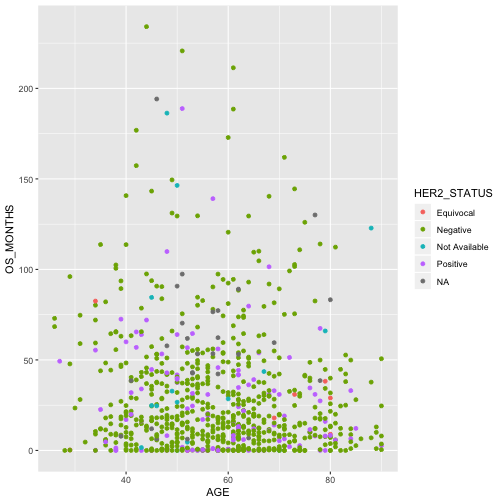

Plotting our data is one of the best ways to
quickly explore it and the various relationships
between variables.

There are three main plotting systems in R,
the [base plotting system][base], the [lattice][lattice]
package, and the [ggplot2][ggplot2] package.

[base]: http://www.statmethods.net/graphs/index.html
[lattice]: http://www.statmethods.net/advgraphs/trellis.html
[ggplot2]: http://www.statmethods.net/advgraphs/ggplot2.html

Today we'll be learning about the ggplot2 package, which is part of the tidyverse.  It is the most effective for creating 
publication quality graphics. There are many extension packages for ggplot2, which make it easy to produce specialised types of
graph, such as survival plots, geographic maps and ROC curves.

ggplot2 is built on the grammar of graphics, the idea that any plot can be
expressed from the same set of components: a **data** set, a
**coordinate system**, and a set of **geoms**--the visual representation of data
points.    

The key to understanding ggplot2 is thinking about a figure in layers.
This idea may be familiar to you if you have used image editing programs like Photoshop, Illustrator, or
Inkscape.

Let's start off with an example, using our brca data:

~~~
ggplot(data = brca, aes(x = AGE, y = OS_MONTHS)) +
  geom_point()
~~~
{: .language-r}

~~~
Warning: Removed 76 rows containing missing values (geom_point).
~~~
{: .error}

So the first thing we do is call the `ggplot` function. This function lets R
know that we're creating a new plot, and any of the arguments we give the
`ggplot` function are the *global* options for the plot: they apply to all
layers on the plot.

We've passed in two arguments to `ggplot`. First, we tell `ggplot` what data we
want to show on our figure, in this example the brca data we read in
earlier. For the second argument we passed in the `aes` function, which
tells `ggplot` how variables in the **data** map to *aesthetic* properties of
the figure, in this case the **x** and **y** locations. Here we told `ggplot` we
want to plot the "AGE" column of the brca data frame on the x-axis, and
the "OS_MONTHS" column on the y-axis. 

By itself, the call to `ggplot` isn't enough to draw a figure:

~~~
ggplot(data = brca, aes(x = AGE, y = OS_MONTHS))
~~~
{: .language-r}

We need to tell `ggplot` how we want to visually represent the data, which we
do by adding a new **geom** layer. In our example, we used `geom_point`, which
tells `ggplot` we want to visually represent the relationship between **x** and
**y** as a scatter-plot of points:

~~~
ggplot(data = brca, aes(x = AGE, y = OS_MONTHS)) +
  geom_point()
~~~
{: .language-r}

~~~
Warning: Removed 76 rows containing missing values (geom_point).
~~~
{: .error}

## Combining `dplyr` and `ggplot2`

As `gplot2` is part of the tidyverse, we can use it with pipes.  As we will see later in the 
episode, this will be particularly useful if we need to modify the data before plotting it.

We can repeat the above plot, using a pipe, as follows:

~~~
brca %>% ggplot(aes(x = AGE, y = OS_MONTHS)) + geom_point()
~~~
{: .language-r}

~~~
Warning: Removed 76 rows containing missing values (geom_point).
~~~
{: .error}

Note that the `ggplot2` commands are joined by the `+` symbol and not the `%>%` symbol.  It may help to remember that we **add** layers to our plot.

## Layers

~~~
brca %>% ggplot(aes(x = AGE, y = OS_MONTHS, color=HER2_STATUS)) + geom_point()
~~~
{: .language-r}

~~~
Warning: Removed 76 rows containing missing values (geom_point).
~~~
{: .error}

But what if we want to visualize both lines and points on the plot? We can
add another layer to the plot:

~~~
brca %>% ggplot(aes(x = AGE, y = OS_MONTHS, group=HER2_STATUS, color=HER2_STATUS)) + 
  geom_point() + geom_line()
~~~
{: .language-r}

~~~
Warning: Removed 76 rows containing missing values (geom_point).
~~~
{: .error}

~~~
Warning: Removed 76 rows containing missing values (geom_path).
~~~
{: .error}

What if we want to print our points in a colour other than the default black?  Aesthetics map
data to a property of the graph.  If we want to change the colour of all our points, we are not using 
the data to specify the colour, so we specify the colour directly in the geom:

~~~
brca %>% ggplot(aes(x = AGE, y = OS_MONTHS)) + 
  geom_line(aes(colour = HER2_STATUS)) +
  geom_point(colour = "red")
~~~
{: .language-r}

~~~
Warning: Removed 76 rows containing missing values (geom_path).
~~~
{: .error}

~~~
Warning: Removed 76 rows containing missing values (geom_point).
~~~
{: .error}

It's important to note that each layer is drawn on top of the previous layer. In
this example, the points have been drawn *on top of* the lines. If we swap the order
of our `geom_line()` and `geom_point()`, the points appear **behind** the lines:

~~~
brca %>% ggplot(aes(x = AGE, y = OS_MONTHS)) + 
  geom_point(colour = "red") + 
  geom_line(aes(colour = HER2_STATUS))
~~~
{: .language-r}

~~~
Warning: Removed 76 rows containing missing values (geom_point).
~~~
{: .error}

~~~
Warning: Removed 76 rows containing missing values (geom_path).
~~~
{: .error}

> ## Tip: Transparency
>
> If you have a lot of data or many layers, it can be useful to make some (semi)-transparent.
> You can do this by setting the `alpha` property to a value between 0 (fully transparent), and 1 (fully opaque).
{: .callout}

## Multi-panel figures

There's still a lot going on in this graph.  It may clearer if we plotted a separate graph
for each HER2_STATUS. We can split the plot into  multiple panels by adding a layer of **facet** panels: 

~~~
brca %>% ggplot(aes(x = AGE, y = OS_MONTHS)) + 
  geom_point(colour = "red") + 
  geom_line() + 
  facet_wrap("HER2_STATUS")
~~~
{: .language-r}

~~~
Warning: Removed 76 rows containing missing values (geom_point).
~~~
{: .error}

~~~
Warning: Removed 76 rows containing missing values (geom_path).
~~~
{: .error}

We have removed
`colour=HER2_STATUS` from the aesthetic since colouring each line by HER2_STATUS conveys no additional
information.  Note that the variable we are faceting by needs to be placed in quotes.

> ## More on faceting
> 
> It's also possible to facet by one or two variables on a grid, using the `facet_grid()` function.  For example, we could plot life GDP per capita's relationship to life expectancy for each combination of continent and year 
> using the following code:
> 
> 
> ~~~
> brca %>% ggplot(aes(x = AGE, y = OS_MONTHS)) + 
>   geom_point(colour = "red") + 
>   geom_line() + 
>   facet_grid(ER_STATUS ~HER2_STATUS)
> ~~~
> {: .language-r}
> 
> 
> 
> ~~~
> Warning: Removed 76 rows containing missing values (geom_point).
> ~~~
> {: .error}
> 
> 
> 
> ~~~
> Warning: Removed 76 rows containing missing values (geom_path).
> ~~~
> {: .error}
> 
> 
> 
> ~~~
> geom_path: Each group consists of only one observation. Do you need to
> adjust the group aesthetic?
> ~~~
> {: .output}
> 
> 
> This uses R's formula notation to specify how we want to arrange to grid; see `?facet_grid` for more details.
> 
{: .callout}

## Plotting 1D data

In the examples so far we've plotted one variable against another.  Often we wish to plot single variable. We often wish to explore the distribution of a continuous variable.  We can do this using a histogram (`geom_histogram()`), 
or a density plot (`geom_density()`).

~~~
brca %>% filter(HER2_STATUS == "Positive") %>% 
  ggplot(aes(x = OS_MONTHS)) + 
  geom_histogram(bins=10)
~~~
{: .language-r}

We can specify the number of bins (`bins = `), or the width of a bin (`binwidth = `).

We can plot a density plot using `geom_density()`.  This is a smoothed version of a histogram.

~~~
brca %>% filter(HER2_STATUS == "Positive") %>% 
  ggplot(aes(x = OS_MONTHS)) + 
  geom_density()
~~~
{: .language-r}

By default the density estimate is drawn in outline (i.e. it isn't filled in).  We can use the `fill` attribute to fill it in; this can be
passed in the aesthetic (e.g. `aes(x = gdpPercap, fill = ...))`) to fill according to the data, or directly to `geom_density()`. The `colour` attribute controls the _outline_ of the shape.  For example:

~~~
brca %>% 
  ggplot(aes(x = OS_MONTHS)) + 
  geom_density(aes(color=HER2_STATUS))
~~~
{: .language-r}

~~~
Warning: Removed 76 rows containing non-finite values (stat_density).
~~~
{: .error}

RStudio provides a really useful [cheat sheet][cheat] of the different layers available, and more
extensive documentation is available on the [ggplot2 website][ggplot-doc].

[cheat]: http://www.rstudio.com/wp-content/uploads/2015/03/ggplot2-cheatsheet.pdf
[ggplot-doc]: http://docs.ggplot2.org/current/

## Saving plots

Having produced a plot, we can save it, or copy it to the clipboard using the "Export" command at the top of RStudio's plot window.

It's a better idea to save your plots as part of your scripts; this way if you modify your analysis code, you _know_ the plot will reflect the results of the code.  If you manually save the plot, you have to remember to do this after changing the script.  

We can save the most recently produced ggplot using the `ggsave()` function:

~~~
ggsave("plots/myplot.png")
# Can also set the size of plot
ggsave("plots/myplot.pdf", width = 20, height = 20, units = "cm")
~~~
{: .language-r}

The help for the `ggsave()` function lists the image formats that are available, as well as the options for setting the resolution and size of the saved image.

## ggplot themes and extensions

ggplot is very flexible, and its capabilities can be extended.  

The _theme_ of a plot affects the background, axes etc.  The [ggplot2 themes package](https://cran.r-project.org/web/packages/ggthemes/) contains many useful (and not so useful) themes we can apply to our data.  The [cowplot package](https://cran.r-project.org/web/packages/cowplot/index.html) makes it easy to plot sub-plots, and to overlay plots within plots.  

The [ggplot2 exensions](http://www.ggplot2-exts.org/) pages lists R packages that can extend its capabilities. If you have a specialised plotting need (for example plotting ROC curves, survival data, or time series) there are packages that will allow you to make these plots with minimal effort. [The top 50 ggplot2 visualisations page](http://r-statistics.co/Top50-Ggplot2-Visualizations-MasterList-R-Code.html) provides examples (with full code) of almost any type of graph you might want to make. 

As an example of how easy it can be to extend ggplot, we will use the `ggridges` plot to produce a stacked density plot, to better visualise the previous figure:

~~~
library(ggridges)
brca %>% 
  filter(HER2_STATUS %in% c("Positive", "Negative")) %>% 
  ggplot(aes(x = OS_MONTHS, y = factor(HER2_STATUS), fill = ER_STATUS)) + 
  geom_density_ridges(alpha = 0.5) 
~~~
{: .language-r}

~~~
Picking joint bandwidth of 11.1
~~~
{: .output}

[Data Visualization - A practical Introduction](http://socviz.co/) is an online book which covers good practice in data visualisation, using R and ggplot2 to illustrate this.

